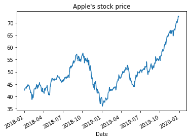
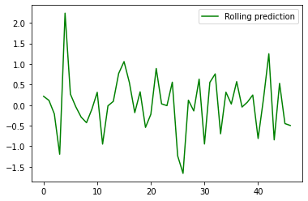
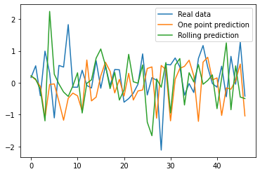
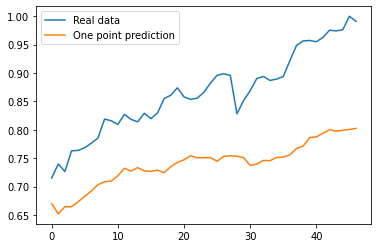
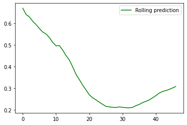
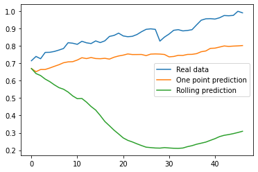

Introduction

As indicated in a previous blog post, time-series models are designed to predict future values based on previously observed values. In other words the input is a signal (time-series) that is defined by observations taken sequentially in time. However, time-series forecasting models such as ARIMA has it own limitations when it comes to non-stationary data (i.e. where statistical properties e.g. the mean and standard deviation are not constant over time but instead, these metrics vary over time). An examples of non-stationary time-series stock price (not to be confused with stock returns) over time.

As discussed in a previous blog post [here](https://kamran-afzali.github.io/posts/2021-01-14/Stock_TS_R.html) there have been attempts to predict stock outcomes (e.g. price, return. etc.) using time series analysis algorithms, though the performance is sub par and cannot be used to efficiently predict the market.

``` {.python}
import pandas as pd
import numpy as np
import matplotlib.pyplot as plt
import pandas as pd
from sklearn.preprocessing import MinMaxScaler
import yfinance as yf
from yahoofinancials import YahooFinancials
%matplotlib inline
```

``` {.python}
appl_df = yf.download('AAPL', 
                      start='2018-01-01', 
                      end='2019-12-31', 
                      progress=False)
appl_df.head()
```

|            | Open      | High      | Low       | Close     | Adj Close | Volume    |
|------------|-----------|-----------|-----------|-----------|-----------|-----------|
| Date       |           |           |           |           |           |           |
| 2018-01-02 | 42.540001 | 43.075001 | 42.314999 | 43.064999 | 41.380238 | 102223600 |
| 2018-01-03 | 43.132500 | 43.637501 | 42.990002 | 43.057499 | 41.373032 | 118071600 |
| 2018-01-04 | 43.134998 | 43.367500 | 43.020000 | 43.257500 | 41.565216 | 89738400  |
| 2018-01-05 | 43.360001 | 43.842499 | 43.262501 | 43.750000 | 42.038452 | 94640000  |
| 2018-01-08 | 43.587502 | 43.902500 | 43.482498 | 43.587502 | 41.882305 | 82271200  |

``` {.python}
appl_df['Open'].plot(title="Apple's stock price")
```

    <AxesSubplot:title={'center':"Apple's stock price"}, xlabel='Date'>



``` {.python}
sc = MinMaxScaler(feature_range = (0, 1))
```

``` {.python}
def preproc( data, lag, ratio):
    data=data.dropna().iloc[:, 0:1]
    Dates=data.index.unique()
    data.iloc[:, 0] = sc.fit_transform(data.iloc[:, 0].values.reshape(-1, 1))
    for s in range(1, lag):
        data['shift_{}'.format(s)] = data.iloc[:, 0].shift(s)
    X_data = data.dropna().drop(['Open'], axis=1)
    y_data = data.dropna()[['Open']]
    index=int(round(len(X_data)*ratio))
    X_data_train=X_data.iloc[:index,:]
    X_data_test =X_data.iloc[index+1:,:]
    y_data_train=y_data.iloc[:index,:]
    y_data_test =y_data.iloc[index+1:,:]
    return X_data_train,X_data_test,y_data_train,y_data_test,Dates;
```

``` {.python}
a,b,c,d,e=preproc(appl_df, 25, 0.90)
```

``` {.python}
spy_df = yf.download('SPY', 
                      start='2018-01-01', 
                      end='2019-12-31', 
                      progress=False)
spy_df.head()
```

|            | Open       | High       | Low        | Close      | Adj Close  | Volume   |
|------------|------------|------------|------------|------------|------------|----------|
| Date       |            |            |            |            |            |          |
| 2018-01-02 | 267.839996 | 268.809998 | 267.399994 | 268.769989 | 253.283142 | 86655700 |
| 2018-01-03 | 268.959991 | 270.640015 | 268.959991 | 270.470001 | 254.885162 | 90070400 |
| 2018-01-04 | 271.200012 | 272.160004 | 270.540009 | 271.609985 | 255.959488 | 80636400 |
| 2018-01-05 | 272.510010 | 273.559998 | 271.950012 | 273.420013 | 257.665283 | 83524000 |
| 2018-01-08 | 273.309998 | 274.100006 | 272.980011 | 273.920013 | 258.136414 | 57319200 |


``` {.python}
def preproc2( data1, data2, lag, ratio):
    common_dates=list(set(data1.index) & set(data2.index))
    data1=data1[data1.index.isin(common_dates)]
    data2=data2[data2.index.isin(common_dates)]
    X1=preproc(data1, lag, ratio)
    X2=preproc(data2, lag, ratio)
    return X1,X2;
```

``` {.python}
dataLSTM=preproc2( spy_df, appl_df, 25, 0.90)
```

``` {.python}
from keras.models import Sequential
from keras.layers import Dense
from keras.layers import LSTM
import keras.backend as K
from keras.callbacks import EarlyStopping
```

``` {.python}
a = a.values
b= b.values

c = c.values
d = d.values
```

``` {.python}
X_train_t = a.reshape(a.shape[0], 1, 24)
X_test_t = b.reshape(b.shape[0], 1, 24)
```

``` {.python}
K.clear_session()
early_stop = EarlyStopping(monitor='loss', patience=1, verbose=1)
model = Sequential()
model.add(LSTM(12, input_shape=(1, 24), return_sequences=True))
model.add(LSTM(6))
model.add(Dense(6))
model.add(Dense(1))
model.compile(loss='mean_squared_error', optimizer='adam')
```

``` {.python}
model.fit(X_train_t, c,
          epochs=100, batch_size=1, verbose=1,
          callbacks=[early_stop])
```

    Epoch 1/100
    430/430 [==============================] - 2s 1ms/step - loss: 0.0260
    Epoch 2/100
    430/430 [==============================] - 0s 1ms/step - loss: 0.0022
    Epoch 3/100
    430/430 [==============================] - 0s 1ms/step - loss: 0.0013
    Epoch 4/100
    430/430 [==============================] - 0s 1ms/step - loss: 0.0013
    Epoch 5/100
    430/430 [==============================] - 0s 1ms/step - loss: 0.0011
    Epoch 6/100
    430/430 [==============================] - 0s 1ms/step - loss: 0.0013
    Epoch 7/100
    430/430 [==============================] - 0s 1ms/step - loss: 0.0010
    Epoch 8/100
    430/430 [==============================] - 0s 1ms/step - loss: 9.7133e-04
    Epoch 00008: early stopping

``` {.python}
ypredr=[]
st=X_test_t[0].reshape(1, 1, 24)
tmp=st
ptmp=st
val=model.predict(st)
ypredr.append(val.tolist()[0])
for i in range(1, X_test_t.shape[0]):
    tmp=np.append(val, tmp[0,0, 0:-1])
    tmp=tmp.reshape(1, 1, 24)
    ptmp=np.vstack((ptmp,tmp))
    val=model.predict(tmp)
    ypredr.append(val.tolist()[0])
```

``` {.python}
plt.plot(ypredr,color="green", label = "Rolling prediction")
plt.legend()
plt.show()
```



``` {.python}
y_pred = model.predict(X_test_t)
plt.plot(d, label = "Real data")
plt.plot(y_pred, label = "One point prediction")
plt.plot(ypredr, label = "Rolling prediction")
plt.legend()
plt.show()
```



``` {.python}
Aa = dataLSTM[0][0].values
Ab = dataLSTM[0][1].values

Ac = dataLSTM[0][2].values
Ad = dataLSTM[0][3].values
X_train_A = Aa.reshape(Aa.shape[0], 1, 24)
X_test_A = Ab.reshape(Ab.shape[0], 1, 24)
```

``` {.python}
Sa = dataLSTM[1][0].values
Sb = dataLSTM[1][1].values

Sc = dataLSTM[1][2].values
Sd = dataLSTM[1][3].values
X_train_S = Sa.reshape(Sa.shape[0], 1, 24)
X_test_S = Sb.reshape(Sb.shape[0], 1, 24)
```

``` {.python}
from keras.layers import concatenate
from keras.layers import Dropout
from keras.models import Sequential
from keras.layers import Dense
import keras.backend as K
from keras.callbacks import EarlyStopping
from keras.layers import LSTM
from keras.models import Input, Model
from keras.layers import Dense
```

``` {.python}
early_stop = EarlyStopping(monitor='loss', patience=1, verbose=1)
input1 = Input(shape=(1,24)) # for the three columns of dat_train
x1 = LSTM(6)(input1)

input2 = Input(shape=(1,24))
x2 = LSTM(6)(input2)

con = concatenate(inputs = [x1,x2] ) # merge in metadata
x3 = Dense(50)(con)
x3 = Dropout(0.3)(x3)
output = Dense(1, activation='sigmoid')(x3)
n_net = Model(inputs=[input1, input2], outputs=output)
n_net.compile(loss='mean_squared_error', optimizer='adam')
```

``` {.python}
n_net.fit(x=[X_train_A, X_train_S], y=Ac, epochs=10, batch_size=1, verbose=1,
          callbacks=[early_stop])
```

    Epoch 1/10
    430/430 [==============================] - 2s 836us/step - loss: 0.0168
    Epoch 2/10
    430/430 [==============================] - 0s 799us/step - loss: 0.0058
    Epoch 3/10
    430/430 [==============================] - 0s 793us/step - loss: 0.0038
    Epoch 4/10
    430/430 [==============================] - 0s 800us/step - loss: 0.0029
    Epoch 5/10
    430/430 [==============================] - 0s 795us/step - loss: 0.0030
    Epoch 6/10
    430/430 [==============================] - 0s 798us/step - loss: 0.0026
    Epoch 7/10
    430/430 [==============================] - 0s 796us/step - loss: 0.0022
    Epoch 8/10
    430/430 [==============================] - 0s 800us/step - loss: 0.0021
    Epoch 9/10
    430/430 [==============================] - 0s 796us/step - loss: 0.0021
    Epoch 00009: early stopping

``` {.python}
y_pred = n_net.predict([X_test_A,X_test_S])
plt.plot(Ad, label = "Real data")
plt.plot(y_pred, label = "One point prediction")
plt.legend()
plt.show()
```



``` {.python}
ypredr=[]
st=X_test_A[0].reshape(1, 1, 24)
sst=X_test_S[0].reshape(1, 1, 24)
tmp=st
ptmp=st
val=n_net.predict([tmp,sst])
ypredr.append(val.tolist()[0])
for i in range(1, X_test_t.shape[0]):
    tmp=np.append(val, tmp[0,0, 0:-1])
    tmp=tmp.reshape(1, 1, 24)
    sst=X_test_S[i].reshape(1, 1, 24)
    ptmp=np.vstack((ptmp,tmp))
    val=n_net.predict([tmp,sst])
    ypredr.append(val.tolist()[0])
```

``` {.python}
plt.plot(ypredr, color="green", label = "Rolling prediction")
plt.legend()
plt.show()
```



``` {.python}
y_pred = n_net.predict([X_test_A,X_test_S])
plt.plot(Ad, label = "Real data")
plt.plot(y_pred, label = "One point prediction")
plt.plot(ypredr, label = "Rolling prediction")
plt.legend()
plt.show()
```




